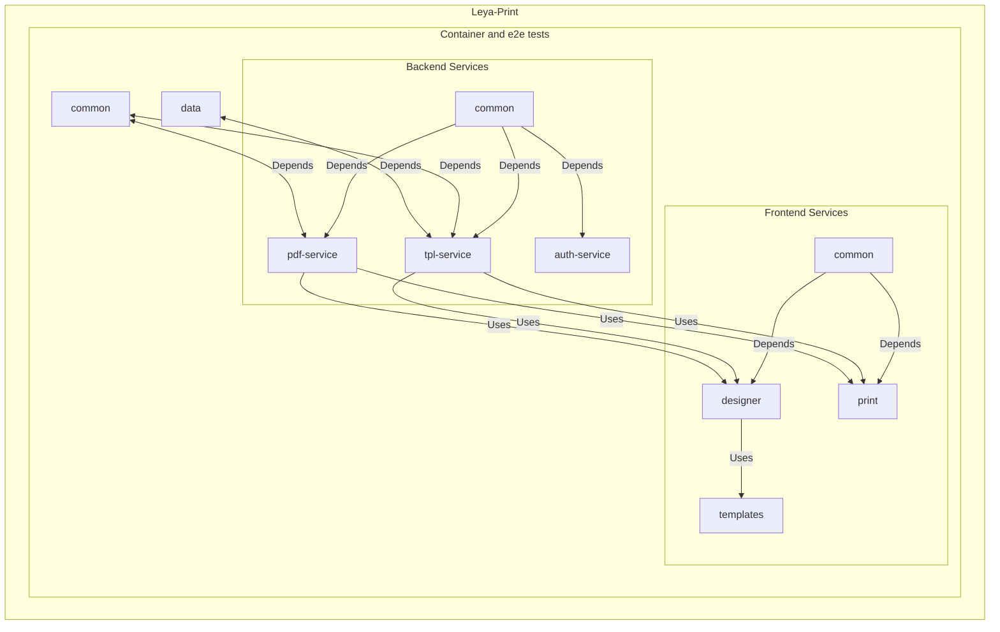

# Project Structure of Leya Print Platform

The Leya Print Platform is organized into several key directories and files that facilitate
its deployment, development, and maintenance. Below is an overview of the primary components
and their roles within the system:

## Web Applications

- **web/common:** Contains shared web components and logic used across Leya Print web applications.
  [Read more](../web/common/README.md)
- **web/print:** Hosts the web application for embedding templates. Provides HTML borders for templates.
  [Read more](../web/print/README.md)
- **web/designer:** A tool for developers to preview and test template changes live.
  [Read more](../web/designer/README.md)
- **web/templates:** Houses sample templates and serves as a development area for creating new templates.
  [Read more](../web/templates/README.md)

## Server-Side Applications

- **server/api:** Contains the OpenAPI definition for all services.
  [View API Documentation](../server/api/openapi-rest.yml)
- **server/common:** Shared server-side logic and utilities.
  [Read more](../server/common/README.md)
- **server/pdf-service:** The core document generation service using Chromium instances to render PDFs.
  [Read more](../server/pdf-service/README.md)
- **server/tpl-service:** Manages template storage and retrieval.
  [Read more](../server/tpl-service/README.md)
- **server/auth-service:** Handles authentication and access control.
  [Read more](../server/auth-service/README.md)

## Containerization

- **server/container:** This directory contains the necessary configurations for running Leya Print
  within a Docker container using NGINX. It plays a critical role in simplifying the deployment
  process by encapsulating the platform into a containerized environment, making it easy to deploy
  across different systems and cloud platforms.
  [Read more](../server/container/README.md)

## Utility Scripts and Configuration

- **start-*.sh:** Scripts to start various components of Leya Print.
- **.gitpod.Dockerfile and .gitpod.yml:** Configures the Gitpod environment.
- **build/scripts/:** Scripts for building and deploying Leya Print services.

## Documentation

- **docs/:** Includes detailed setup guides and operational procedures.
  [Browse docs](../docs/)
- **[README.md](../README.md):** The main document providing an overview and starting instructions.

## Other Directories

- **data/:** Used as a persistence layer during development and for deploying templates with the server.
  Each template is uploaded in a new folder named by a generated unique id. The metadata is collected in the [template-packages.json](../data/template-packages.json). This /data folder is also used by the docker containers, so you can place templates there that get deployed along with the container.
- **common/:** Contains the `@leya-print/template-api`, which defines the structure of metadata required
  for uploaded templates. This is a standalone npm package, available via npmjs, serving as a crucial resource for template projects.
  [Read more](../common/README.md)
- **e2e/:** Contains end-to-end tests and configurations.
  [Read more](../e2e/README.md)

For detailed information on each component or service, refer to the README.md file located in
the respective directory. This structure is designed to be modular and scalable, accommodating
the needs of both development and production environments.

## Additional Files

- **[LICENSE](../LICENSE):** The licensing information for Leya Print.
- **[CONTRIBUTE.md](../CONTRIBUTE.md):** Guidelines for contributing to the Leya Print project.

## Overview Diagram

