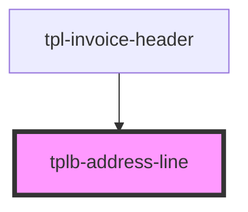

# tplb-address-line

<!-- Auto Generated Below -->

## Properties

| Property  | Attribute | Description | Type      | Default     |
| --------- | --------- | ----------- | --------- | ----------- |
| `address` | --        |             | `Address` | `undefined` |

## Dependencies

### Used by

 - [tpl-invoice-header](../../templates/invoice)

### Graph

----------------------------------------------

*Built with [StencilJS](https://stenciljs.com/)*
